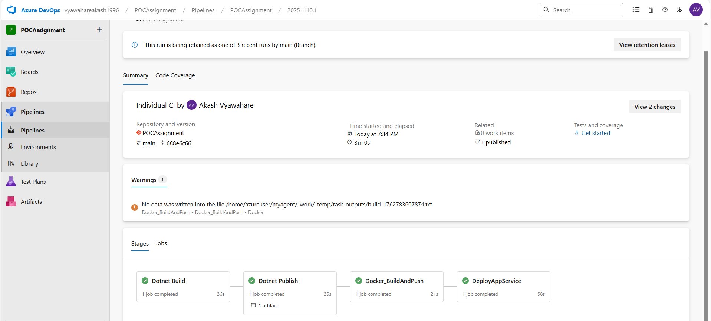

# Assignment: Dockerize a .NET 8 Application With CICD Pipeline and Deploy on Azure WebApp 

This project is a file containes details of  **Dockerize a .NET 8 Application With CICD Pipeline and Deploy on Azure WebApp ** 

## Overview

This Project Contains  below Tools  :
- Azure Devops YAML Pipeline  =  CICD
- Azure  Container registry = Docker Image Store 
- Azure Web App = Deploy Application on Azure 

### Stages  to Deloy  Application using Azure Pipeline  

1) Build   - Build Dotnet Application 
2) Publish   - Publish Artifact 
3) Docker_BuildAndPush  - Create Docker Image and Push it to  Azure  Container registry
4) DeployAppService  - Deploy Application on Azure Web App 

## **Stages in Pipeline**

