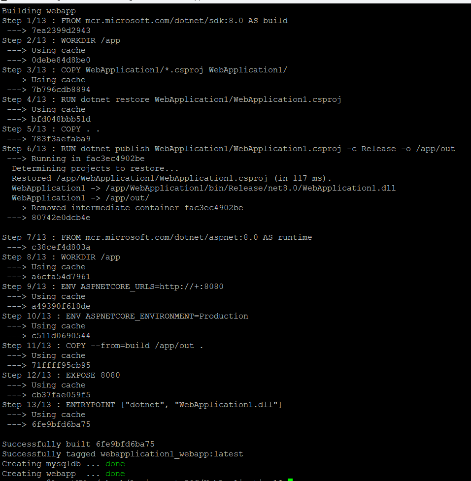
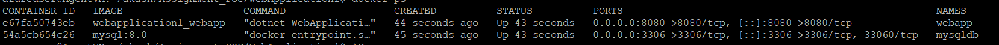
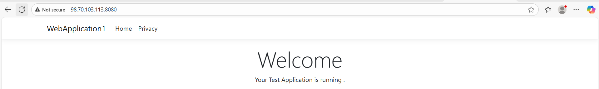
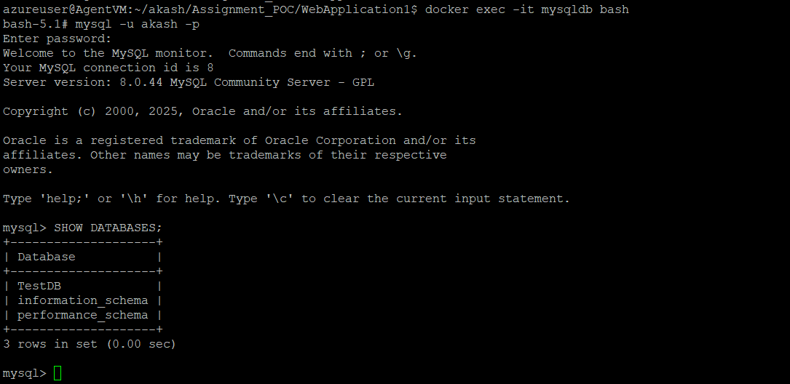
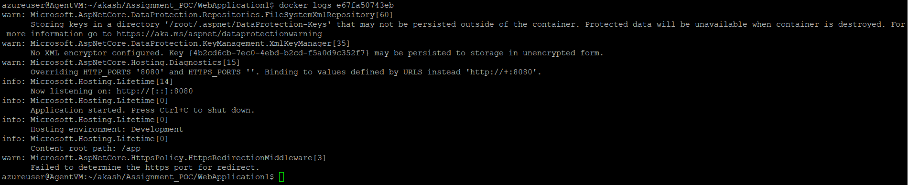

# WebApplication1 – ASP.NET Core (.NET 8)

This project is a basic **.NET 8 Web Application** using Razor Pages. It demonstrates how to dockerize a .NET application using a `Dockerfile` and `docker-compose`.

## Tech Stack
- Docker

## Project Structure
WebApplication1
├── Dockerfile
├── WebApplication1
├── WebApplication1.sln
└── docker-compose.yaml

## Installation

### Prerequisites
- [.NET 8 SDK](https://dotnet.microsoft.com/en-us/download/dotnet/8.0)
- [Docker](https://www.docker.com/get-started)
- [Docker Compose](https://docs.docker.com/compose/install/)

### Steps to Run Application using Docker Containers 

# 1. Clone the repository:

#git clone https://github.com/vyawahareakash2210/Assignment_POC.git

Change Directory 
#cd Assignment_POC

Change Directory 
#cd WebApplication1/

# 2.Build the Docker image & Run the application using Docker Compose :

#docker-compose up --build -d

# 3. Check Running Docker Containers : 

#docker ps

# 4.Open your browser and navigate to:

#http://localhost:8080

# 5. Access MySQL & Show Databases

#docker exec -it mysqldb bash
#mysql -u akash -p
#SHOW DATABASES;

# 6. Web App Container Logs 

#docker logs $containerID

